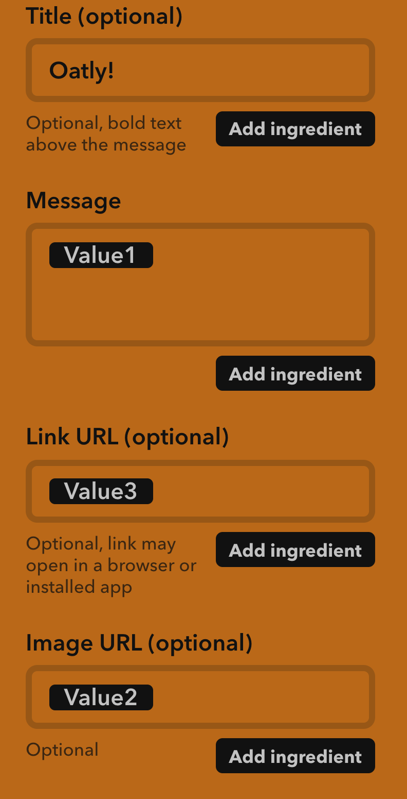

# oatly-checker

This is designed to check Amazon Prime Now for Oatly brand Oat Milk. Mmmm.
It'll notify you if the stock changes so:
- If one type of Oatly goes in/out of stock
- If there's nothing left
You'll be notified only once per event, so running this every 15 mins won't send you a notification every 15 mins.

Anyway, if you want to deploy it:
- Sign up for AWS Lambda
- Make a new function
- Add a CloudWatch trigger for every x amount of time (mine is 15 mins)
- Download this code
- Run `npm i` (to get axios)
- Zip up the directory
- Upload to Lambda
- Go to IFTTT (sign in!)
  - My applets
  - New Applet
  - Webhook
  - Recieve web request
  - Name it
  - Notification (you must download the IFTTT app and turn on notifications), you can also use anything else
  - Set it up with the config [here](#ifttt-notification-setup)
  - Save to IFTTT
  - Back to Lambda
- Environment Variables:
| Name | Value |
| :------------- | :------------- |
| `COOKIE` | Grab your cookie string from a signed in prime now account. Can be done over Charles proxy or via chrome dev tools. (should be in `key=value;` format) |
| `ISOATLY` | `[]` |
| `TEST` | `FALSE` |
- Click on test (the input and event doesn't matter)
- Click on save
- Set up an IFTTT

# IFTTT Notification Setup

